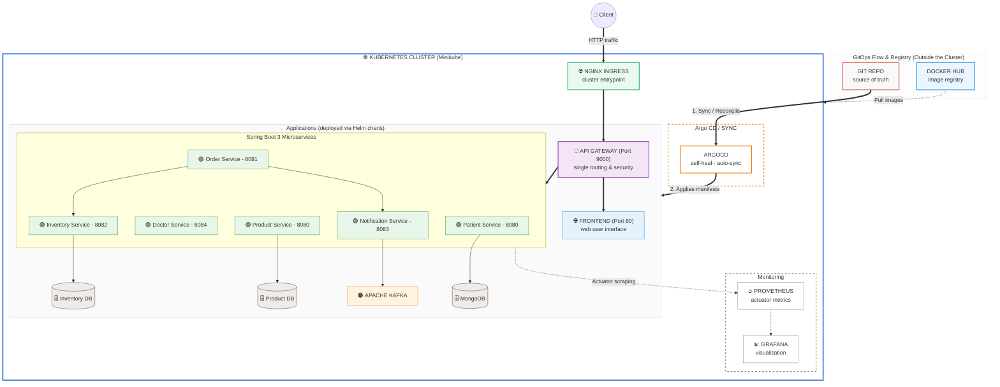

# 🚀 Microservices Platform — Spring Boot 3 · Kubernetes · GitOps

A Spring Boot 3 microservices platform, containerized with Docker, packaged as independent Helm charts, and deployed on Kubernetes (validated on Minikube).

The cluster is continuously reconciled by Argo CD (GitOps, self-heal enabled): the Git repository is the single source of truth for the cluster state.

## 🧩 Microservices

| Service                  | Port   | Description                                                        |
| ------------------------ | ------ | -------------------------------------------------------------------- |
| **api-gateway**           | `9000` | Single entry point, dynamic routing, and security.                   |
| **order-service**         | `8081` | Order management and transaction orchestration.                      |
| **product-service**       | `8080` | Medical product and care catalog management.                         |
| **inventory-service**     | `8082` | Stock management and resource availability.                          |
| **notification-service**  | `8083` | Notifications to patients and doctors via Apache Kafka.              |
| **doctor-service**        | `8084` | Practitioner data and availability management.                       |
| **patient-service**       | `8080` | Patient records and medical history management (MongoDB).            |
| **frontend**               | `80`   | Web user interface for clients.                                      |

> ⚠️ **Networking note**: `product-service` and `patient-service` both use port `8080`. This isn't an issue inside the cluster (each service gets its own pod IP), but keep it in mind if you test these services outside the cluster (simultaneous port-forwarding, docker-compose) to avoid local port conflicts.

## 📐 Overall architecture & GitOps pipeline



**Health checks & metrics**: each service exposes its own liveness/readiness probes on `/actuator/health`, and its metrics via `/actuator/prometheus`.

## 🛠️ Tech stack

| Layer               | Technology                                                                                                            |
| -------------------- | ------------------------------------------------------------------------------------------------------------------------ |
| Application          | Spring Boot 3, Java                                                                                                      |
| Containerization      | Docker                                                                                                                    |
| Orchestration         | Kubernetes (Minikube)                                                                                                     |
| Packaging             | Helm (`charts/<service>`)                                                                                                 |
| GitOps                | Argo CD (`argocd/`), `selfHeal: true`, `prune: true`                                                                      |
| Deployed manifests    | Generated from the Helm charts, versioned in `k8s/manifests/generated`                                                    |
| Metrics               | Micrometer → `/actuator/prometheus`                                                                                       |
| Scraping              | Kubernetes annotations (`prometheus.io/scrape`, `prometheus.io/path`, `prometheus.io/port`) — no Prometheus Operator or `ServiceMonitor` CRD |
| Monitoring            | Prometheus + Grafana                                                                                                      |

## 📂 Repository structure

```
.
├── api-gateway/              # API Gateway service source code
├── doctor-service/           # Doctor service source code
├── inventory-service/        # Inventory service source code
├── notification-service/     # Notification service source code (Kafka)
├── order-service/            # Order service source code
├── patient-service/          # Patient service source code (MongoDB)
├── product-service/          # Product service source code
├── frontend/                 # UI source code
├── charts/                   # 1 Helm chart per service (values.yaml, templates/)
├── k8s/manifests/generated/  # Rendered manifests, the actual source applied by Argo CD
├── argocd/                   # Argo CD Application definitions
└── docker-compose.yml        # Local run alternative without Kubernetes
```

## 🔄 GitOps — operational constraints

With `syncPolicy.automated.selfHeal: true` enabled on the Argo CD Applications, any drift between the cluster and the state defined in `k8s/manifests/generated` is automatically reconciled (default cycle ~3 minutes, or immediate in watch mode).

> ⛔ **Important**: direct commands such as `kubectl set image`, `kubectl edit`, or a local `helm upgrade` have **no lasting effect**. Any change must be committed and pushed to `main` for Argo CD to pick it up.

Image update cycle:

```bash
# 1. Build the image and load it into Minikube
docker build -t bechir19/<service>:<tag> .
minikube image load bechir19/<service>:<tag>

# 2. Edit charts/<service>/values.yaml → image.tag: "<tag>"

# 3. Re-render the manifest
helm template <release> charts/<service> > k8s/manifests/generated/<service>.yaml

# 4. Apply the change through Git
git add charts/<service>/values.yaml k8s/manifests/generated/<service>.yaml
git commit -m "chore: bump <service> to <tag>"
git push origin main
```

## 📊 Observability — configuration

Each Kubernetes `Service` carries these annotations so it gets automatically scraped by Prometheus:

```yaml
annotations:
  prometheus.io/scrape: "true"
  prometheus.io/path: "/actuator/prometheus"
  prometheus.io/port: "<service-port>"
```

Prometheus (`prometheus-community/prometheus` chart) and Grafana are themselves deployed via Argo CD (Applications `prometheus-monitoring` and `grafana-monitoring`), with limited persistent storage (5 Gi) and `alertmanager`/`pushgateway` disabled to save resources on a local cluster.

## ⚙️ Running the project locally

```bash
# 1. Start the local cluster
minikube start

# 2. Build and load an image
docker build -t <image>:<tag> .
minikube image load <image>:<tag>

# 3. Direct Helm deployment (outside GitOps)
helm install <release> ./charts/<service>

# 4. Or deploy following the GitOps flow (recommended)
kubectl apply -f argocd/
```

## 💡 Lessons learned

This project was an opportunity to put several advanced concepts into practice:

- **Helm packaging**: designing independent, modular Helm charts for Java microservices.
- **A solid GitOps pipeline**: implementing Git as the source of truth, with self-heal and automatic reconciliation.
- **Real incident debugging**:
  - diagnosing deployments that silently ignored a new image because of Argo CD's strict reconciliation (`imagePullPolicy: Never` combined with a reused image tag);
  - troubleshooting Kubernetes Services with incorrect selectors, silently pointing to the wrong pods due to naming mistakes in generated manifests.

None of this is learned from a tutorial — it's discovered by confronting the system with its own failures.
