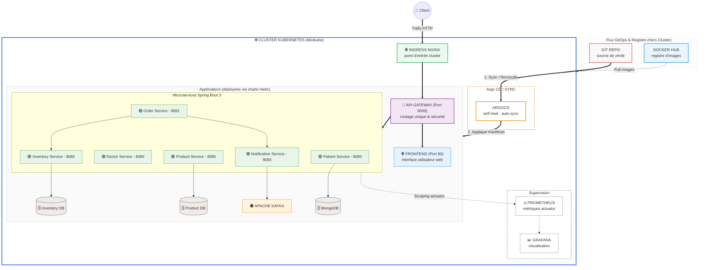

# 🚀 Microservices Platform — Spring Boot 3 · Kubernetes · GitOps

Plateforme de microservices Spring Boot 3, conteneurisés avec Docker, packagés sous forme de charts Helm indépendants et déployés sur Kubernetes (validé sur Minikube).

Le cluster est réconcilié en continu par Argo CD (GitOps, self-heal actif) : le dépôt Git constitue la seule source de vérité pour l'état du cluster.

## 🧩 Microservices

| Service                  | Port   | Description                                                            |
| ------------------------ | ------ | ------------------------------------------------------------------------ |
| **api-gateway**           | `9000` | Point d'entrée unique, routage dynamique et sécurité.                    |
| **order-service**         | `8081` | Gestion des commandes et orchestration des transactions.                 |
| **product-service**       | `8080` | Gestion du catalogue de soins et des produits médicaux.                  |
| **inventory-service**     | `8082` | Gestion des stocks et disponibilité des ressources.                      |
| **notification-service**  | `8083` | Envoi de notifications via Apache Kafka aux patients et aux médecins.    |
| **doctor-service**        | `8084` | Gestion des données et des disponibilités des praticiens.                |
| **patient-service**       | `8080` | Gestion des dossiers patients et de l'historique médical (MongoDB).      |
| **frontend**               | `80`   | Interface utilisateur web pour les clients.                              |

> ⚠️ **Note sur la configuration réseau** : `product-service` et `patient-service` utilisent tous deux le port `8080`. Ce n'est pas un problème à l'intérieur du cluster (chaque service a sa propre IP de pod), mais à vérifier si vous testez ces services hors cluster (port-forward simultané, docker-compose) pour éviter tout conflit de port local.

## 📐 Architecture globale & pipeline GitOps



**Healthchecks & métriques** : chaque service embarque ses propres sondes de santé (liveness / readiness) sur `/actuator/health`, et expose ses métriques via `/actuator/prometheus`.

## 🛠️ Stack technique

| Couche              | Technologie                                                                                                          |
| ------------------- | ----------------------------------------------------------------------------------------------------------------------- |
| Applicatif          | Spring Boot 3, Java                                                                                                     |
| Conteneurisation    | Docker                                                                                                                   |
| Orchestration       | Kubernetes (Minikube)                                                                                                   |
| Packaging           | Helm (`charts/<service>`)                                                                                               |
| GitOps              | Argo CD (`argocd/`), `selfHeal: true`, `prune: true`                                                                    |
| Manifests déployés  | Générés depuis les charts Helm, versionnés dans `k8s/manifests/generated`                                               |
| Métriques           | Micrometer → `/actuator/prometheus`                                                                                     |
| Scraping            | Annotations Kubernetes (`prometheus.io/scrape`, `prometheus.io/path`, `prometheus.io/port`) — pas d'opérateur Prometheus ni de CRD `ServiceMonitor` |
| Supervision         | Prometheus + Grafana                                                                                                     |

## 📂 Structure du répertoire

```
.
├── api-gateway/              # code source du service API Gateway
├── doctor-service/           # code source du service Praticiens
├── inventory-service/        # code source du service Inventaire
├── notification-service/     # code source du service Notifications (Kafka)
├── order-service/            # code source du service Commandes
├── patient-service/          # code source du service Patients (MongoDB)
├── product-service/          # code source du service Produits
├── frontend/                 # code source de l'interface UI
├── charts/                   # 1 chart Helm par service (values.yaml, templates/)
├── k8s/manifests/generated/  # manifests rendus, source appliquée par Argo CD
├── argocd/                   # définitions des Applications Argo CD
└── docker-compose.yml        # alternative d'exécution locale sans Kubernetes
```

## 🔄 GitOps — contraintes opérationnelles

Grâce à `syncPolicy.automated.selfHeal: true` sur les Applications Argo CD, toute divergence entre le cluster et l'état défini dans `k8s/manifests/generated` est automatiquement réconciliée (cycle par défaut de ~3 minutes, ou immédiat en mode watch).

> ⛔ **Important** : les commandes directes comme `kubectl set image`, `kubectl edit` ou `helm upgrade` lancées en local n'ont **aucun effet durable**. Tout changement doit impérativement être commité et poussé sur `main` pour qu'Argo CD le prenne en compte.

Cycle de mise à jour d'une image :

```bash
# 1. Build de l'image et chargement dans Minikube
docker build -t bechir19/<service>:<tag> .
minikube image load bechir19/<service>:<tag>

# 2. Éditer charts/<service>/values.yaml → image.tag: "<tag>"

# 3. Régénérer le manifest
helm template <release> charts/<service> > k8s/manifests/generated/<service>.yaml

# 4. Appliquer le changement via Git
git add charts/<service>/values.yaml k8s/manifests/generated/<service>.yaml
git commit -m "chore: bump <service> to <tag>"
git push origin main
```

## 📊 Observabilité — configuration

Chaque `Service` Kubernetes porte ces annotations pour être automatiquement collecté par Prometheus :

```yaml
annotations:
  prometheus.io/scrape: "true"
  prometheus.io/path: "/actuator/prometheus"
  prometheus.io/port: "<port-du-service>"
```

Prometheus (chart `prometheus-community/prometheus`) et Grafana sont eux-mêmes déployés via Argo CD (Applications `prometheus-monitoring` et `grafana-monitoring`), avec un stockage persistant limité (5 Gi) et `alertmanager`/`pushgateway` désactivés pour économiser les ressources sur un cluster local.

## ⚙️ Lancer le projet en local

```bash
# 1. Démarrer le cluster local
minikube start

# 2. Build et chargement d'une image
docker build -t <image>:<tag> .
minikube image load <image>:<tag>

# 3. Déploiement direct via Helm (hors GitOps)
helm install <release> ./charts/<service>

# 4. Ou déploiement en respectant le flux GitOps (recommandé)
kubectl apply -f argocd/
```

## 💡 Retours d'expérience & apprentissages

Ce projet a permis de mettre en pratique et d'approfondir plusieurs concepts avancés :

- **Empaquetage Helm** : conception de charts Helm indépendants et modulaires pour des microservices Java.
- **Pipeline GitOps robuste** : mise en œuvre de la source de vérité Git avec self-heal et réconciliation automatique.
- **Résolution d'incidents réels** :
  - diagnostic de déploiements ignorant une nouvelle image à cause de la réconciliation stricte d'Argo CD (`imagePullPolicy: Never` + tag d'image réutilisé) ;
  - débogage de Services Kubernetes aux sélecteurs incorrects, pointant silencieusement vers de mauvais pods à la suite d'erreurs de nommage dans les manifests générés.

Rien de tout ça ne s'apprend dans un tutoriel — ça se découvre en confrontant le système à ses propres pannes.
